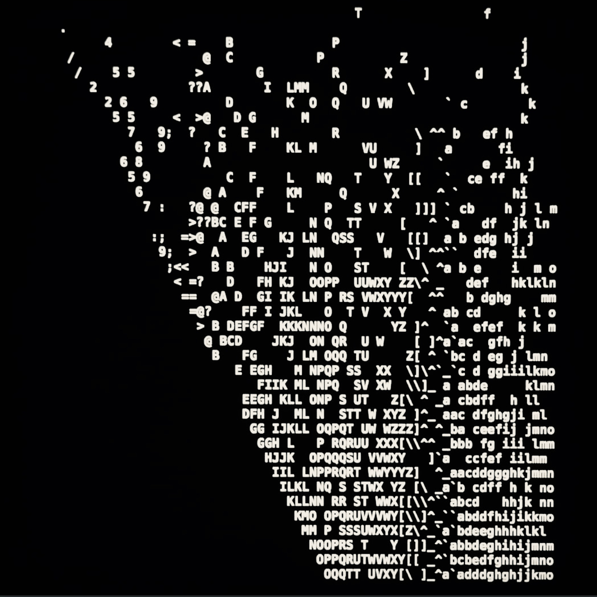

import { getImage, GatsbyImage } from 'gatsby-plugin-image';
import  Layout  from '../../../src/components/Layout'
import  Header  from '../../../src/components/Header'
import  NavBar  from '../../../src/components/NavBar'
import  Footer  from '../../../src/components/Footer'

<Header />
<Header />
<Header />
<Header />
<Header />
<NavBar />
<NavBar />
<NavBar />
<NavBar />
<NavBar />
<NavBar />
<NavBar />
<NavBar />
<NavBar />

<h1>{_frontmatter.title}</h1>

# noise

## noise

### noise
#### noise
##### noise
###### noise

---

```
js
some.noise()
rand()
rand()
rand()
rand()
rand()
```


<Footer />
<Footer />
<Footer />
<Footer />
<Footer />
<Footer />
<Footer />
<Footer />
<Footer />
<Footer />
<Footer />
<Footer />
<Footer />
<Footer />
<Footer />
<Footer />
<Footer />
<Footer />
<Footer />
<Footer />
<Footer />